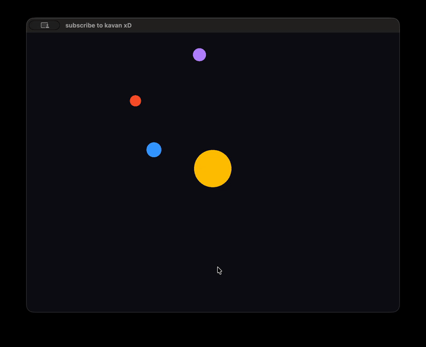

### 9/17: 

#### I. Circle by method of triangulation
The first step is to render a circle. The process works as follows.  

The intuition:  
Say you want to draw a circle on a canvas. The display only recognizes triangles. Say you draw a triangle with vertices: (0, 0), (50, 0), (0, 50). The graphics library can render better approximations of a circle with more pizza slices.  

Draw_Circle Function:  
The parameter cx, cy, and r is fed into the draw circle function.  
Draw triangles using the graphics library functions begin(triangle_fan), vertex(x,y), and end().  
Use the following trigonometric identities cos(angle), sin(angle).  

### 9/18:
#### II. Moving planets. 
The next step would be to implement movement. Planets accelerate and have velocity on top of their position coordinates.  

The intuition:  
Say you want to implement an acceleration and velocity feature every time the canvas updates.  
For each planet:  
Update velocity  = acceleration * dt;  
Update position = velocity * dt;  
Planet.position = updated position;  

#### III. 2D gravity. 
Planets don’t move linearly, they affect the planets around them given their relative distance and mass. This push and pull phenomenon is described by Newton's Orbital Mechanics.  

The intuition:  
Say we have the Sun and three other planets. We can describe the planet being moved as p and other planets as other. We can show the position of p after some dt as follows:  

set acceleration of x and y directions to 0.  
for every other planet p1, p2, p3… pn, not including our planet pi:  

first find the distance r  
dx = other.x - p.x;  
dy = other.y - p.y;  
r = sqrt(dx^ 2 + dy^2)  

calculate the acceleration (nudge) from every other planet and add it to ax and ay  
a = Gm/r^2  
ax += a * (dx / r);  
ay += a * (dy / r);  

outside the for loop:  
nudge the planet's velocity for some delta t, and nudge the planet's position for some delta t to get our new and updated position with respect to a tiny change in time.   

##### Newton's Orbital Mechanics (it’s a video)

observations:  
*planets fling out once they accelerate too close into the orbit  
*planets move faster the closer they get to the Sun  
*the Sun wobbles due to the gravitational pull of planets that are closer and have more mass!  

